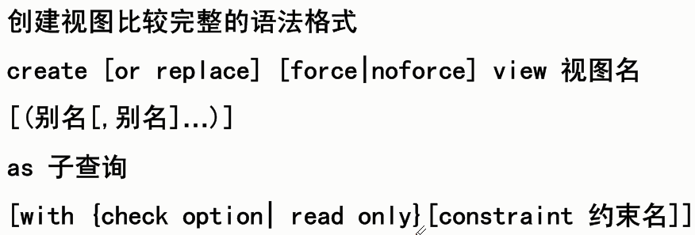
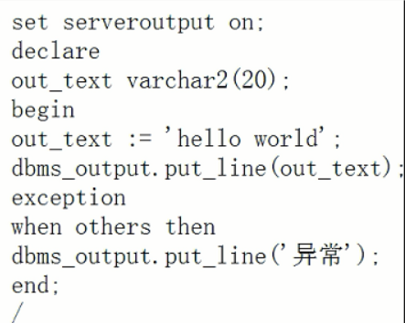

# 数据库 #
表之间的关系，表征数据之间的关系，比用文件系统更好管理数据。

流行的DBMS有Oracle、MySQL、SQL Server；
SQL是大多数主流DBMS采用的标准查询语言。
####发展历程： 层次型->网状型->关系型。 ####
实体-关系模型（E-R图）：

1. 实体：表
2. 属性：实体特性
3. 联系：一对一、一对多、多对多

# SQL #
排错信息网站：<http://ora-code.com/>
### 分类 ###
1. 数据定义语言 DDL ： create，drop，alter，rename，truncate	 ————不能回滚
2. 数据操作语言 DML : insert，update，delete ————可以回滚；要commit才更新到数据库
3. 数据控制语言 DCL ： grant，revoke
4. 查询语言			： select
5. 事务控制语言 TC	： commit，rollback，savepoint

> ### rollback：
>
- 没有commit的数据删除后无法rollback
- commit了的数据删除后可以使用rollback恢复
- 删除数据后commit则无法使用rollback恢复。
>### drop：
>放到回收站里面

# Oracle #
一般不会轻易在一个服务器上创建多个数据库，在一个数据库中，不同的项目由不同的用户访问，每一个用户拥有自身创建的数据库对象（表）。（即一个数据库，不同的用户管理不同的表。）
#### 数据库服务要启动；  ####
-  **OracleService+服务名**，该服务是数据库启动的基础，只有该服务启动了，Oracle数据库才能正常启动。这是必须启动的服务。
2. **OracleOraDb10g_home1TNSListener**，该服务是服务器端为客户端提供的监听服务，只有该服务在服务器上正常启动，客户端才能连接到服务器。该监听服务接收客户端发出的请求，然后将请求传递给数据库服务器。一旦建立了连接，客户端和数据库服务器就能直接通信了。
3. **OracleOraDb10g_home1iSQLPlus**，该服务提供了用浏览器对数据库中数据操作的方式。该服务启动后，就可以使用浏览器进行远程登录并进行数据库操作了。
4. **OracleDBConsole+服务名**，Oracle10g中的一个新服务。在Oracle9i之前，Oracle官方提供了一个基于图形界面的企业管理器（EM），从Oracle10g开始，Oracle提供了一个基于B/S的企业管理器，在操作系统的命令行中输入命令：emctl start dbconsole，就可以启动OracleDbConsole服务。

### 常用操作 ###
list，显示缓存的语句

	l
直接运行缓存的语句

	/
相当于 l + / ，先显示缓存语句，再执行

	r
标志语句结束

	;
n是行数，定位并查看缓存中第n行的语句

	n
append，先定位到第n行，然后在这行语句后面追加代码

	a
change，修改语句

	c /被修改内容/新内容 ：
删除缓存中第n行的语句

	del n
>若报错，可能是用户没有session权限

## 1、用户： ##
SQL*PLUS：与oracle数据库进行交互的客户端工具。
###（1）创建用户 ###
有创建用户权限的用户（如系统管理员）才能创建用户。

	create user 用户名 identified by 密码;

	//修改用户的密码
	alter user 用户名 identified by 新密码
### （2）角色/权限 ###
	//授予角色（权限的集合）
	grant connect,resource to 用户名;
		- CONNECT角色，主要应用在临时用户，特别是那些不需要建表的用户，通常只赋予他们CONNECT role。CONNECT是使用Oracle的简单权限，拥有CONNECT角色的用户，可以与服务器建立连接会话（session，客户端对服务器连接，称为会话）。
		- RESOURCE角色，更可靠和正式的数据库用户可以授予RESOURCE role。RESOURCE提供给用户另外的权限以创建他们自己的表、序列、过程（procedure）、触发器（trigger）、索引（index）等。
		- DBA角色，DBA role拥有所有的系统权限----包括无限制的空间限额和给其他用户授予各种权限的能力。用户SYSTEM拥有DBA角色。
		一般情况下，一个普通的用户（如SCOTT），拥有CONNECT和RESOURCE两个角色即可进行常规的数据库开发工作。

	//授予某一项权限
	grant create view to 用户名;

	//撤销角色/权限
	revoke 角色|权限 from 用户名;
		
	//查看自身有哪些角色
	select * from user_role_privs;

	//查看自身的角色和权限
	select * from role_sys_privs;

	//修改用户处于锁定（非锁定）状态，锁定状态是不能登录的
	alter user 用户名 account lock|unlock;

### （3）查询用户 ###
	select * from all_users;
### （4）用户登录 ###
	sqlplus 用户名/密码 [@host_string] [用户身份];

	//普通用户
	sqlplus 用户名/密码；

	//系统管理员登录，必须指定身份，as sysdba或者as sysoper，可以不输入密码也能正常登陆
	sqlplus sys/ as sysdba;
>用户登录失败原因：

1. 被锁定
2. 没有登录权限
3. 忘记密码
4. 用户不存在
### （5）切换用户 ###
	connect 用户名/密码;

## 2、常用数据类型 ##

- char型数据，后面自动用空格补齐
## 3、表操作 ##
#### （1）查询表 ####
	desc 表名
#### （2）创建表 ####
可以为自己创建表，也可以为其他用户创建表。

	//方式一：
	create table [用户名.]表名(
		列名 数据类型 [default 默认值][, ...]
	)

	create table 表名(
		列名1 char(10), --注释
		列名2 varchar2(20),
		列名3 date,
		列名3 integer,
		列名3 number（6,2） --整数最多4位，小数最多2位
	)；

	//方式二：利用子查询创建表，相当于复制操作
	create table 表名[列名1，列名2...] as 子查询;

	create table B as select * from A;
#### （3）截断表 ####
删除表数据，保留表结构，数据无法恢复。

	truncate table 表名
#### （4）删除表 ####

	//1、闪回删除————10g新特性
	drop table 表名

	//查看回收站
	show recyclebin;

	//从回收站恢复表
	flashback table 表名 to before drop;
	
	//清空回收站
	purge recyclebin;

	//2、彻底删除(级联删除 + 不放回收站)
	drop table 表名 [cascade contraints] [purge]
#### （5）修改表 ####
1.插入新列 add

	alter table 表名 
	add 列名1 数据类型 [default 默认值] [，列名n...]

	alter table A
	add age number(2) default 23; 
2.删除列 drop

	alter table 表名 
	drop column 列名;

3.修改列 modify
	
	alter table 表名 
	modify 列名1 数据类型 [default 默认值] [，列名n...]

	alter table A
	modify age integer(2) default 23; 

	//若改变类型后长度小于已有数据的长度，会报错，可以先清空值
	update 表名 set 列名1='';

## 4、数据操作 ##
#### （1）插入数据 ####
	insert into 表名 values(值1,值2...);
	insert into 表名 (列名1,列名2...) values(值1,值2...);
插入date型:

	insert into 表名 (列名1) values(to_date('1999-09-09','yyyy-MM-dd'))：
#### （2）更新数据 ####
一般更新、基于一个表来更新、利用多列子查询来更新。

	update 表名 set 列名=数值[,列名=数值] [where 条件];
	
	update A set age=13,name='Tom' where rownum=1;
> rownum是行号，rowid是数据记录的地址。
#### （3）删除数据 ####
语句用于删除表中的**行**。

	delete from 表名 [where 条件]

	//删除所有行
	delete from 表名	
	delete * from 表名

#### （4）虚表 ####
用于查询一个不存在于任何表中的数据。

	select sysdate from dual;
	select length('abc') from dual;

## 5、约束CONSTRAINT ##

> 外键的值允许为空，如果插入值，则必须能在父表中找到。先建父表再建子表。

**创建表时添加约束：**

	create table student
	(
	id number(5) primary key,
	team_id varchar2(5) foreign key references team(id),
	address varchar2(20) not null，
	country varchar2(10) unique,
	gender varchar2(2) check(gender='man' or gender='woman'),
	);

	//或
	create table student
	(
	id number(5),
	team_id varchar2(5),
	country varchar2(10),
	gender varchar2(2),
	constraint pk_student_id primary key(id),
	constraint fk_student_tid foreign key(team_id) references team(id),
	constraint uk_student_co unique(country),
	constraint student_sex_ck check(gender='man' or gender='woman'),
	);

**创建表后添加约束：**

	alter table A add primary key(id);
	alter table A add foreign key(team_id) references team(id);
	alter table A modify address not null;
	alter table A add unique (country);
	alter table A add check(gender='man' or gender='woman');

	//或
	alter table A add constraint pk_student_id PRIMARY KEY (id);
	alter table A add constraint fk_student_tid foreign key(team_id) references team(id);
	alter table A add constraint uk_student_co unique (country);
	alter table A add constraint student_sex_ck check(gender='man' or gender='woman');
**删除约束：**
	
	alter table A drop constraint 约束名;
**查看约束：**

	desc user_constraints;     

	select owner,constraints_name,constraints_type,table_name from user_constraints;

	desc user_cons_columns;	

	select owner,constraints_name,table_name,column_name from user_cons_columns;

> 通过外键两表联查：
	
> 	select * from student,team where team_id=team.id;

## 6、SQL查询语句 ##

#### （1）使用算术表达式 +-*/ ####
	select 列名+20 from 表名;

#### （2）取别名 as ####
	//为列取别名
	select 列名 as 别名 from 表名;
	select 列名 别名 from 表名;
	select 列名 "别名" from 表名;  

	//为表取别名
	select * from 表名 别名;

#### （3）连接运算符 || ####
	select 列名 || 'abcdefg' from 表名;

#### （4）去重 distinct ####
	select distinct 列名 from 表名;
#### （5）过滤 where####
	select * from 表名 where 列名 比较操作符 数值|表达式|列名;
	
	WHERE Customer='Bush' OR Customer='Adams'
	WHERE Address IS NULL
	WHERE Address IS NOT NULL
	WHERE Year>1965
	WHERE OrderPrice>(SELECT AVG(OrderPrice) FROM Orders)
	WHERE City LIKE '%lon%'
	WHERE City NOT LIKE '%lon%'

#### （6）通配符 % _ ####
- % ：0个或多个字符；
- _ ：1个字符
- [charlist]：	字符列中的任何单一字符
- [^charlist]或者[!charlist]	：不在字符列中的任何单一字符；

		select * from 表名 where 列名 like 's_a%y';
		select * from 表名 where 列名 not like 's_a%y';	

		//以 "A" 或 "L" 或 "N" 开头的人：
		SELECT * FROM Persons WHERE City LIKE '[ALN]%'

		SELECT * FROM Persons WHERE City LIKE '[!ALN]%'
		
		//转义escape,可以将一个字符当成是转义字符
		select * from 表名 where 列名 like 's\_a\%y' escape '\';
		select * from 表名 where 列名 like 's$_a$%y' escape '$';
#### （7）排序 order by ####
	select * from 表名 order by 列名 ASC|DESC;
	select 列名 别名 from 表名 order by 别名;
	select * from 表名 order by 列名1 ASC, 列名2 DESC,列名3 DESC;
	select 列名1 列名2 from 表名 order by 2;				//根据列名2进行排序
#### （8）分组 group by ####
将行分组为具有相同列值的多个部分，大多数与聚合函数一起出现。如果查询中包含一个聚合函数，而同时有查询的列并不在聚合函数中，那么这个列必须在group by子句中。

	select gender,count(gender) from A group by gender
	select job,avg(sal) from A group by job	

	//语法错误
	select gender,count(gender) from A 
#### （9）聚合比较 having ####
聚合函数作比较要放在having中，而不能放在where中。分组->计算聚合->聚合比较。

	select job,avg(sal) from A where gender='man' group by job having avg(sal)>1500
## 7、SQL函数 ##
需要select或者having才能返回结果，在where中是不返回结果的。
### （1）单行函数 ###
#### 1. 字符函数 ####
		
		//将第一个字母转成大写
		initcap(n)
		//从m位置开始在x中查找字符串y出现的位置，n是出现次数
		instr(x,y,m,n)
		//求字符串长度
		length(n)
		//将字符串各字符转换成小写
		lower(x)
		//大写......
		upper(x)

		//在字符串x左边补齐字符y（缺省则补空格），得到总长为n的字符串
		lpad(x,n,y)
		//在字符串x右边......
		rpad(x,n,y)

		//去掉左边\右边\两边去掉指定字符
		select trim(leading '*' from '**sbash**') from dual;
		//x左边去掉指定字符y，默认去空格
		ltrim(x,y)
		//x右边......
		rtrim(x,y)

		//如果x不是null，则返回x，否则返回y
		nul(x,y)
		//如果x不是null，则返回y，否则返回z
		nul2(x,y,z)
		//如果x是数字，则返回x，否则返回y
		nanvl(x,y)

		//x中替换y为z
		replace(x,y,z)
		//从字符串x中的m开始取长度为n的子串，n缺省时取到结尾
		substr(x,m,n)
		//连接字符串
		concat(m,n)
#### 2. 数字函数 ####

	
**round：四舍五入**

	round(5.89,-1)   	 // 10 保留十位数
	round(5.89)    	 	 // 6 保留个位数
	round(5.89,1)   	 // 5.9
	round(15.89,-1)   	 // 20
	round(15.89,-2)   	 // 0
**trunc：截断**
	
	trunc(5.89,-1)   	 // 0
	trunc(5.89)   	 	 // 5
	trunc(5.89,1)   	 // 5.8
#### 3. 转换函数 ####

	//转换为日期
	select to_date('2018-06-18','yyyy-MM-dd') from dual
	
	//转为为二进制数
	bin_to_num(n)

	//2018-06-18 09:35:45
	select to_char(sysdate,'yyyy-MM-dd HH24:mi:ss') from dual

#### 4. 日期函数 ####
	//获取系统时间
	select sysdate from dual		//18-6月 -18

	
	//求下个月最后一天
	select last_day(add_mon ths(sysdate,1)) from dual

	//从x开始，下一个第n天的日期（从星期天开始算）
	select next_day(sysdate,n) from dual

	//-.03225806
	select months_between(sysdate,sysdate+1) from dual

	//18-6月 -18     01-1月 -18     01-7月 -18
	select round(sysdate),round(sysdate,'yyyy'),round(sysdate,'MM') from dual

	//18-6月 -18     01-1月 -18     01-6月 -18
	select trunc(sysdate),trunc(sysdate,'yyyy'),trunc(sysdate,'MM') from dual

	//2018-06-18 09:35:45
	select to_char(sysdate,'yyyy-MM-dd HH24:mi:ss') from dual
###（2）聚合函数 ###

	//count，返回非空数据的条数
	select count(*) from A

	//min、max求最值
	select min(列名),max(列名) from A
	
	//sum求和，avg求均值
	select sum(列名),avg(列名) from A
## 8、高级SQL查询 ##

	//两表联查
	select a.sno,sname from student a join score c on a.sno=c.sno
	//三表联查
	select a.sno,sname,cname from student a join score c on a.sno=c.sno join course b on b.cno=c.cno
### (1)内连接 inner join ###
检索两表的匹配行
#### 1）等值连接 ####
	select a.sno,sname from student a join score c on a.sno=c.sno where a.age=20
#### 2）不等值连	####
	select a.sno,sname from student a join score c on a.sno=c.sno where a.age>20
#### 3）自然连接 ####
通过相同的列将两表联系起来，不用写on条件

	select a.sno,sname from student natural join score
	//等价于
	select a.sno,sname from student a join score c on a.sno=c.sno
	//等价于
	select a.sno,sname from student join score using(sno)
### (2)外连接 outer join ###
检索一个表的所有记录和另一表中的匹配行
#### 1）左外连接 left join ####
两表匹配的行 + 左表中剩余的行

	select a.sno,sname,cno from student a left outer join score c on a.sno=c.sno
	//等价于
	select a.sno,sname,cno from student a,score c where a.sno=c.sno(+)
#### 2）右外连接 right join####
两表匹配的行 + 右表中剩余的行

	select a.sno,sname,cno from student a right outer join score c on a.sno=c.sno
	//等价于
	select a.sno,sname,cno from student a,score c where a.sno(+)=c.sno
#### 3）全连接 full join####
	select a.sno,sname,cno from student a full outer join score c on a.sno=c.sno
### (3)集合运算 ###
#### 1>union ####
用于合并两个或多个 SELECT 语句的结果集。UNION 内部的 SELECT 语句必须拥有相同数量的列。列也必须拥有相似的数据类型。同时，每条 SELECT 语句中的列的顺序必须相同。UNION 结果集中的列名总是等于 UNION 中第一个 SELECT 语句中的列名。

	SELECT column_name(s) FROM table_name1
	UNION
	SELECT column_name(s) FROM table_name2	

	//可重复
	SELECT column_name(s) FROM table_name1
	UNION ALL
	SELECT column_name(s) FROM table_name2  
#### 2>intersect ####
求交集，两表相同的部分

	SELECT column_name(s) FROM table_name1
	intersect
	SELECT column_name(s) FROM table_name2
#### 3>minus ####
求差集，两表不相同的部分

	SELECT column_name(s) FROM table_name1
	minus
	SELECT column_name(s) FROM table_name2
## 9、子查询  ##
- 单行子查询
- 多行子查询
- 多列子查询
- 关联子查询
- 嵌套子查询
### （1）单行子查询 ###
子查询不能包含order by。可以在where、having、having中。

	//where中————查询年龄 小于 平均年龄的学生的学号和姓名
	select id,name from student where age< (select avg(age) from student);

	//语法错误，聚合函数应该在having中做比较
	select id,name from student where age<avg(age);

	//having中————查询课程为‘c002’的平均成绩 大于 所有学生的平均分
	select cno,avg(score) from sc where cno='c002' group by cno 
	having avg(score)>(select avg(score) from sc);

	//from中————查询哪些员工的工资 高于 所任职位的平均工资
	select ename,sal,avgjob from emp a,
	(select avg(sal),job from emp group by job) b 
	where a.job=b.job and a.sal>b.avgjob;

	//错误写法，子查询返回的是一个表
	select ename，工资 from 表名 where 工资>（select 职位，avg(工资) from 表名 group by 职位）;
### （2）多行子查询 ###
#### <1>使用IN操作符 ####
	
	//查询 各个职位中工资最高 的员工信息 (两个职位的最高工资相同时，只显示其中一个)
	select empno,ename,job,sal from emp where sal in(select max(sal) from emp group by job)

	//上面的改进版，由于查询多了个job，所以就算sal相同也会显示
	select empno,ename,job,sal from emp where (sal,job) in(select max(sal),job from emp group by job)
#### <2>使用exists操作符 ####
是否存在，返回真或者假。
	
	select empno,ename,sal from emp where exists(select * from dept where deptno = '40')
#### <3>使用all操作符 ####
- all 返回列表中的每一个值
- >all 为大于最大的（大于所有值）
- <all 为小于最小的（小于所有值）
- =all 什么都不是。

		select empno,ename,sal,job from emp where sal < all(select avg(sal) from emp group by job)
#### <4>使用any操作符 ####
- <any ：小于最大的（小于任一个值）
- >any ：大于最小的（大于任一个值）

		select empno,ename,sal,job from emp where sal < any(select avg(sal) from emp group by job)
## 10、视图 ##
一个或多个表上的预定义查询。
### （1）优点 ###

- - -
### （2）创建语法 ###

- - -

- - -
### （3）创建视图 ###
	create or replace noforce view v_emp ("empno","ename","sal") 
	as select empno,ename,sal from emp where sal>1000;

	create or replace noforce view v_emp 
	as select empno,ename,sal from emp;
### （4）对视图的DML操作 ###
只能对简单的视图（基于一张表）进行DML操作。
	
	insert into v_emp(id,name) values(001,'Jason')
	insert into v_emp values(001,'Jason'，'lloijs',2461)
#### <1>with check option ####
	create or replace noforce view v_emp 
	as select empno,ename,sal from emp where sal>1000 with check option;

	//插入失败，要满足where后面的条件
	insert into v_emp values(001,'Jason',500)
#### <2>with read only ####
	create or replace noforce view v_emp 
	as select empno,ename,sal from emp  with read only;

	//插入失败，因为是只读with read only
	insert into v_emp values(001,'Jason',500)

## 11、PL/SQL编程 ##

### (1)构成###
1. declare部分

		定义变量、常量（CONSTANT）、游标
		
		- 变量： a number(9) := 10;
		- 常量： PI CONSTANT number(9) := 3.141592653;
		- 赋值： :=    或者    default 或者 into
2. BEGIN和END部分
3. EXCEPTION部分

### (2)变量类型###
- 标量类型变量<<重点>>
- 复合类型变量<<重点>>
- 参照类型变量
- LOB类型变量

#### <1>标量类型变量 ####

	
	// into 关键词可以将select得到的数据赋值给变量
	sum_number number(5);
	select count(*) into sum_number from  student

	// %type   将表中的列的类型作为变量id的数据类型。
	id 表名.列名%type;
	select sno into id from student where sname='mike'

	// %rowtype   将表一行的类型作为变量id的数据类型。
	id 表名%rowtype;
	select * into id from student where sno='001'
#### <2>复合类型变量 ####
1. 记录类型
	
	可以存储多个标量值（即一行数据），结构与行相似。

2. 记录表类型
	
	允许用户在代码中使用“表”，以便存储多行数据。

	set serveroutput on
	declare
	type t_table is table of varchar2(20) index by binary_integer;
	t t_table;
	begin
	t(1) := 'a';
	t(2) := 'b';
	dbms_output.put_line(t.count())
	end
	/

### (3)条件判断语句###
#### IF语句 ####
	IF condition1 THEN
		statement1;
	ELSIF condition2 THEN
		statement12;
	ELSE 
		statement3;
	END IF;
		
#### CASE语句 ####
	CASE 变量
	WHEN 值1 THEN statement1;
	WHEN 值2 THEN statement2;
	...
	[ELSE statementS;]
	END CASE;

#### 循环语句 ####
	//第一种
	loop 
		statements;
	end loop;

	//第二种
	while condition loop
		statements;
	end loop;

	//第三种
	for i in 1..10 loop 
		statements;
	end loop;

	//跳出循环
	[exit when condition;]

练习：创建student表（id，name）并将其放入到记录表变量中，然后将记录表变量中的数据打印出来。
	
	create table student (id integer,name varchar2(20));
	
	declare
	i student.id%type;
	name student.name%type;
	
	num integer;
	begin 
	for n in 1..10 loop
		insert into student values(n,'user'||n);
	end loop;
	end;
	/
	
	declare
	type s_record is record(
		id student.id%type,
		name student.name%type
	);
	type s_recordtable is table of s_record index by binary_integer;
	t s_recordtable;
	m int :=1;
	begin
	for n in (select id,name from student)loop
		t(m) := n;
		m:=m+1;
	end loop;
	dbms_output.put_line('记录表的长度：'|| t.count());
	for n in t.first()..t.last() loop
		dbms_output.put_line(t(n).id ||'————'||t(n).name);
	end loop;
	end;
	/
### 12、游标 ###
游标机制处理多行记录结果集；类似于指针，使程序一次可以处理其中的一行记录。
#### 12.1隐式游标 ####
执行***一个SQL语句***时，oracle服务器将自动创建一个隐式游标，这个游标存储执行SQL语句的结果。

- %found：布尔型，至少影响一行操作
- %notfound：布尔型，一行都不影响
- %isopen：布尔型，游标是否已打开
- %rowcount：number型，受SQL语句影响的行数

		declare
		a student%rowtype;
		begin 
		select * into a from student where id='5';
		update student set name='gaide' where id>'2';
		dbms_output.put_line('受上面一句SQL语句影响的行数:'||sql%rowcount);				--8
		if sql%found then
			dbms_output.put_line('找到数据:'||a.id);
		end if;
		exception when others then 
			dbms_output.put_line('没有找到数据！');
		end;
		/
#### 12.2显式游标 ####
当查询结果返回多于一行时，必须使用显式游标。
声明->打开->检索->关闭

	declare
		cursor mycur(m integer) is select id,name from student where id>m;		-- 定义游标
		type s_record is record(
			id integer,
			name varchar2(20)
		);
		s s_record;
	begin 
		open mycur(3);					-- 打开游标
		loop
			fetch mycur into s;			-- 利用游标检索数据，每次找出一行，然后赋值给s
			exit when mycur%notfound;	-- 游标到最后了
			dbms_output.put_line(s.id||'  '||s.name);
		end loop;
		close mycur;					--关闭游标
	end;
	/
	

	//下面的是另外一种查询返回多行结果的方法，t是记录表类型
	for n in (select id,name from student)loop
	    t(m) := n;
	    m:=m+1;
	end loop;
	

		